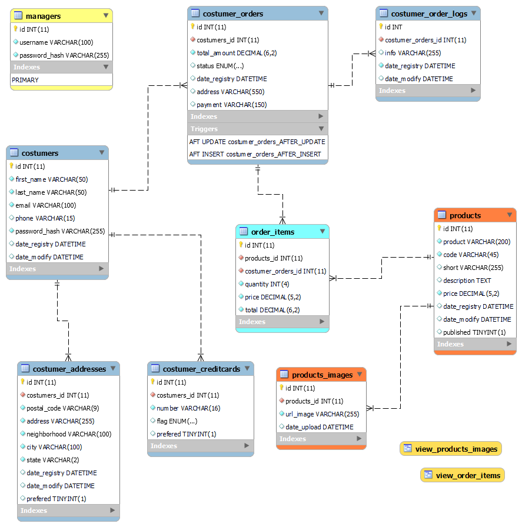

# 🍰 Loja Virtual de Cupcakes (cupcakestore)

<h3 align="left">Autor:</h3>

Jansen Lira

<h3 align="left">Desenvolvido em:</h3>

     

Este é o repositório do projeto de **Loja Virtual de Cupcakes**, desenvolvido como parte da disciplina de **Engenharia de Software** do curso de **Engenharia de Software** da **Unicsul**.

## 📖 Sobre o Projeto

A Loja Virtual de Cupcakes foi desenvolvida com o objetivo de proporcionar uma experiência simples e intuitiva para os usuários. Todos os recursos estão disponíveis em **uma única página**, incluindo:

- **Login** do usuário.
- **Seleção de produtos** disponíveis para compra.
- **Realização de pedidos** de forma prática.
- **Alteração de dados** do usuário.

Além disso, o sistema possui **duas interfaces principais**:

1. **Página da Loja** (root): Voltada para os clientes realizarem suas compras.
2. **Administração do Sistema** (manager): Para gerenciar os produtos, pedidos e clientes cadastrados.

## 🛠️ Tecnologias e Bibliotecas Utilizadas

O sistema foi desenvolvido utilizando **PHP** e conta com a contribuição das seguintes bibliotecas e ferramentas de terceiros:

- **[CoffeeCode Router](https://packagist.org/packages/coffeecode/router)**: Gerenciamento de rotas.
- **[PHP Plates](https://platesphp.com/)**: Motor de templates.
- **[Bootstrap 5.3](https://getbootstrap.com/docs/5.3/)**: Design responsivo e estilização.
- **[jQuery](https://jquery.com/)**: Manipulação de DOM.
- **[Mustache.js](https://mustache.github.io/)**: Renderização de templates JavaScript.
- **[DataTables.js](https://datatables.net/)**: Tabelas interativas e dinâmicas.

## 📋 Modelo SQL do Banco de Dados

O banco de dados foi modelado para atender às funcionalidades do sistema, incluindo a gestão de usuários, produtos e pedidos. Abaixo está o modelo SQL utilizado no projeto:

